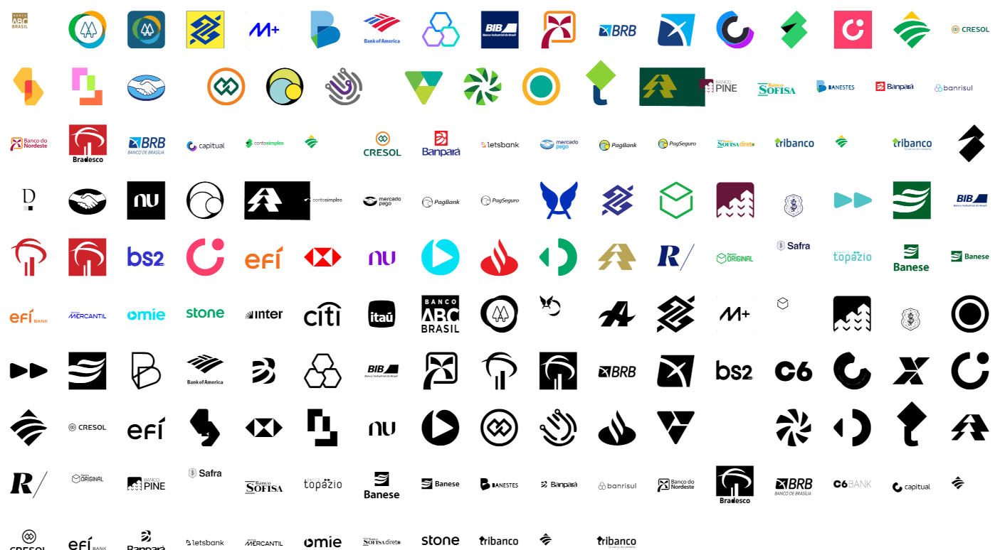

# Pacote de ícones dos bancos.

[](https://github.com/Matheusouza2)
[](https://www.jsdelivr.com/package/gh/Matheusouza2/icons-banks)

### Para criação das fontes foram utilizados como referência os repositórios https://github.com/matheuscuba/icones-bancos-brasileiros e https://github.com/Tgentil/Bancos-em-SVG para extração de alguns ícones. Outros ícones foram feitos tratamentos próprios para adequação a fonte.

# Logos dos Bancos



## Utilização

Baixe o projeto e utilize os assets necessários. OU

#### Via CDN

```
<!-- Adicone o CSS no HEAD do seu HTML -->
<link rel="stylesheet" href="https://cdn.jsdelivr.net/gh/Matheusouza2/icons-banks@1.1/assets/all.css">

<!-- Adicione o JS antes do fechamento da tag BODY -->
<script src="https://cdn.jsdelivr.net/gh/Matheusouza2/icons-banks@1.1/assets/mountIcons.min.js"></script>
```

#### P&B

Para utilizar apenas os ícones P&B baixe o `icons-black.css` o `mountIconsBlack.min.js` da pasta assets e as fontes `icons-banks.*` da pasta `dist/fonts`

#### Colorido

Para utilizar apenas os ícones P&B baixe o `icons-colored.css` o `mountIconsColored.min.js` da pasta assets e as fontes `icons-color-banks.*` da pasta `dist/fonts`

#### Todos

Para utilizar apenas os ícones P&B baixe o `all.css` o `mountIcons.min.js` da pasta assets e as fontes `icons-banks-all.*` da pasta `dist/fonts`

### Com os arquivos importados basta chamar os icones

```
<!-- Imprimir logo do banco do brasil -->
<i class="ib ib-bb ib-lg"></i>
<!-- Imprimir logo da caixa -->
<i class="ib ib-cef ib-lg"></i>
```

### No arquivo `index.html` tem todos os exemplos de uso

## Lista de Bancos Disponíveis

Aqui está a lista de bancos cujos logos estão presentes neste repositório:

1. ABC Brasil
2. Ailos
3. Asaas IP S.A
4. Banco BS2 S.A
5. Banco BTG Pacutal
6. Banco C6 S.A
7. Banco da Amazônia S.A
8. Banco Daycoval
9. Banco do Brasil S.A
10. Banco do Estado do Espirito Santo
11. Banco do Estado do Para
12. Banco do Estado do Sergipe
13. Banco do Nordeste do Brasil S.A
14. Banco Industrial do Brasil S.A
15. Banco Inter S.A
16. Banco Mercantil do Brasil
17. Banco Original S.A
18. Banco Pine
19. Banco Rendimento
20. Banco Safra S.A
21. Banco Santander Brasil S.A
22. Banco Sofisa
23. Banco Topazio
24. Banco Triângulo - Tribanco
25. Bank of America
26. Banrisul
27. Bradesco S.A
28. BRB - Banco de Brasília
29. Caixa Econômica Federal
30. Capitual
31. Conta Simples Soluções em Pagamentos
32. Cora Sociedade Credito Direto S.A
33. Credisis
34. Cresol
35. Efí - Gerencianet
36. Grafeno
37. Itaú Unibanco S.A
38. Lets Bank S.A
39. Mercado Pago
40. Nu Pagamentos S.A (Nubank)
41. Omie.cash
42. PagSeguro Internet S.A
43. Quality Digital Bank
44. Sicoob
45. Sicredi
46. Stone Pagamentos S.A
47. Unicred
48. Uniprime
49. Bancos Escuros (Subpasta com alguns bancos já mencionados)

## Contribuição

Se você deseja contribuir com este repositório abra uma issue de preferência já adiconando o SVG do banco criado por você.
Se verificar que pode melhorar a forma de renderização dos ícones coloridos ficarei feliz em aceitar seu Pull Request.

## Licença

Estes logos são propriedade de seus respectivos bancos. Este repositório é apenas uma coleção de ícones e vetorização dos mesmos para fontes e não possui qualquer afiliação ou endosso dos bancos mencionados. Utilize os logos de acordo com as diretrizes de marca de cada banco e respeite os direitos autorais.

## Autor

- Matheus Souza
